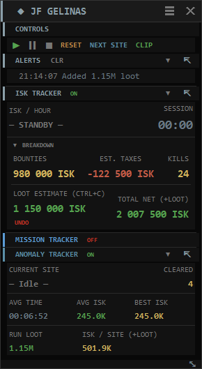
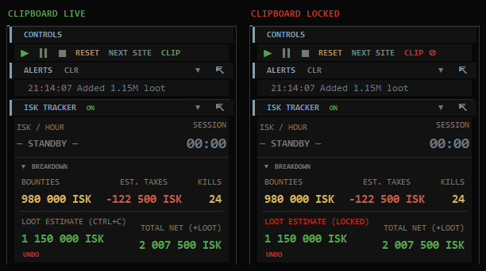

# Eve Ratting

A lightweight desktop dashboard for **EVE Online** PvE pilots. Eve Ratting watches your client's gamelog files in real time and turns them into a clean, themed overlay showing DPS, ISK/hour, bounties, taxes, loot value, missions, anomalies and EWAR alerts — without ever touching the game client.

The tool is a single Python script (or standalone `.exe`) using Tkinter. A **fleet overview window** acts as the hub and automatically spawns a separate dashboard for every character whose gamelog it finds, making it usable across multiple accounts simultaneously.

## Screenshots

| | |
|---|---|
|  |  |
| A character dashboard: controls, alerts, ISK breakdown and the anomaly tracker | The clipboard lock, armed and disarmed |

## Features

- **Fleet overview** — one hub window lists every detected character in a compact table (TOTAL NET, ISK/HR, session time, and a per-character DPS-overlay toggle); columns are centered and can be dragged to resize, with widths and window geometry remembered; new characters appear automatically every 10 seconds
- **Per-character dashboards** — each pilot gets its own always-on-top, draggable window that auto-sizes to its content
- **Live combat tracking** — outgoing/incoming DPS over a sliding 15-second window, total damage dealt and received, hits and misses, peak DPS
- **ISK metrics** — gross bounties, configurable tax rate, loot estimation, net ISK and ISK/hour with a collapsible breakdown panel
- **Bounty backfill** — on Play, the last 15 minutes of the log are replayed so recent bounties are never missed
- **Mission tracker** — objective completion, completed-mission count and storyline progress (EVE offers one every 16 missions, and the client tells you nothing about where you are in that cycle). Note that the *name* of the current mission is not shown: EVE writes it to no log file, so no log reader can know it
- **Anomaly tracker** — automatically segments ratting into discrete sites by combat gap, tracks per-site time and ISK, computes averages and best site, and reports the **run loot** and an all-in **ISK per site** for multi-site MTU runs; configurable gap threshold
- **EWAR alerts** — instant warnings for warp scramble and stasis web attempts, escalation and dreadnought spawn notifications, with a visual flash and an audible beep. These are the events that stop you *leaving*, so they are the only ones that make a sound
- **Loot clipboard** — paste an EVE cargo/loot window (Ctrl+A, Ctrl+C) while running; prices are looked up via ESI (Jita sell for faction/deadspace items, universe average for everything else, with an offline fallback table)
- **Clipboard lock (CLIP)** — stop the app reading the clipboard at all, so you can copy a fitting or paste your cargo into an external appraisal site without it being counted as loot
- **Undo last loot import (UNDO)** — pop the last valued cargo back off the session total, repeatedly, when something got counted that should not have been
- **Standings tracker** — captures faction standing changes from the gamelog
- **Session history** — persistent JSON history with lifetime totals; browsable per-character in a scrollable popup (the file keeps the most recent 1 000 sessions)
- **Detached panels** — pop any section (ISK, Missions, Anomalies, Alerts) out into its own always-on-top resizable window; positions remembered between sessions
- **DPS overlay** — a standalone, transparent DPS overlay per character that floats over your ship like EVE's own combat "messages" frame: just the **DPS OUT** (blue) and **DPS IN** (red) numbers — and an optional live graph — over the game, with no window box. **Left-click** the **DPS** cell in the Fleet Overview to open/close it; **right-click** that cell for a menu (**Reposition** · **View ▸ Numbers / Graph / Numbers+graph** · **Close**). A fresh overlay opens in *move mode* (white outline + ✕ + resize grip); drag it over your ship, then click **✕** to *set* it — once placed the box disappears, leaving only the text, and it becomes **click-through** so your mouse passes straight to EVE. Independent of the global opacity slider; position, size, view and placed/move state are remembered per character. *Transparency and click-through are Windows-only, and a topmost overlay draws over EVE only in Fixed-Window or Borderless mode, not exclusive fullscreen.*
- **Collapsible sections** — each panel can be collapsed to its header bar to save screen space; the whole window can be collapsed to just its title bar with a double-click
- **22+ themes** — EVE Online default plus faction palettes (Caldari, Minmatar, Amarr, Gallente, Guristas, Blood Raiders, Angel Cartel, Serpentis, Sansha's Nation, Triglavian, EDENCOM, Intaki Syndicate, ORE, Mordu's Legion, Thukker Tribe, CONCORD, Society of Conscious Thought and more); applied live with no flicker, saved per character
- **Configurable opacity** — set window transparency from 20 % to 100 % (default 85 %)
- **System tray** — minimize to tray (optional, requires `pystray` + `Pillow`)
- **Standalone executable** — a pre-built `Eve Ratting.exe` is included; no Python required to run it

## How it works

Eve Ratting is a passive log reader. It tails the files EVE Online writes to:

```
%USERPROFILE%\Documents\EVE\logs\Gamelogs
```

It parses combat lines, bounty payouts, mission events, EWAR attempts and standings updates with regular expressions, then aggregates them into per-character dashboards. **No memory reading, no packet sniffing, no API keys, no client modification** — it only reads files the game itself writes to disk. This keeps it fully compliant with the EVE Online EULA.

Each character is discovered from the gamelog filename, which ends in that pilot's character ID — that is the only stable identifier, since display names can change. A new gamelog is opened by the client on every session, so the app follows the rotation automatically and keeps counting when you relog or undock.

## Requirements

- **Windows 10/11** or **Linux** (native client, Steam, or Proton — log paths are auto-detected)
- **Python 3.9+** (uses `datetime.timezone`, f-strings, `deque`, etc.) — *or* use the included `Eve Ratting.exe`
- **Tkinter** (bundled with the standard Python.org installer)
- **EVE Online** client with gamelogs enabled (on by default)

Optional Python packages (the app runs without them, with reduced functionality):

| Package | Purpose |
|---|---|
| `pystray` | System tray icon |
| `Pillow` | Required by `pystray` for the tray image |
| `pyperclip` | Clipboard paste support for loot estimation |
| `watchdog` | Event-driven log watching (falls back to timer polling if absent) |

Audio EWAR alerts (a short beep on warp-scramble / stasis-web) use `winsound`, which is part of the Python standard library on Windows — no install needed.

## Quick start

```bash
# 1. Clone
git clone https://github.com/psychojf/Eve-Ratting.git
cd Eve-Ratting

# 2. (optional) install optional dependencies
pip install -r requirements.txt

# 3. Run
python ratting.py
```

Or just double-click **Eve Ratting.exe**.

On first launch the app creates `ratting_config.json` next to the script, auto-detects your EVE gamelog directory and opens the fleet overview plus one dashboard per character. Open **Settings** (⚙ in the overview header) to change the gamelog path, opacity, corp tax, update interval, site gap, theme and background monitoring.

For a full walkthrough see [HOW_TO.txt](HOW_TO.txt).

## Controls

| Button | Action |
|---|---|
| ▶ Play | Start the session timer; back-fills the last 15 min of bounties |
| ⏸ Pause | Freeze the timer; parsing continues in the background |
| ■ Stop | Freeze the display and halt. **Does not save** — the session is written to history on Reset, Next Site, or Quit |
| RESET | Save the session to history, then wipe everything and start fresh |
| NEXT SITE | Identical to RESET (see below) |
| CLIP | Lock/unlock clipboard reading — global, mirrored in every window |
| UNDO | Remove the last loot import from this character's session |

## SITE GAP vs NEXT SITE

Both have "site" in the name and they do **completely different things**. This trips up most new users, so it is worth being precise.

### SITE GAP — automatic, harmless

A **setting** (Settings ▸ SITE GAP, default 45 seconds).

The anomaly tracker watches for silence in the combat log. Once `SITE GAP` seconds pass with no combat, it decides the current site is finished; the next combat line starts a new one. That is the whole mechanism — EVE never announces that you entered or left an anomaly, so silence is the only available signal.

What it touches: **only the anomaly tracker's own counters** — CLEARED, AVG TIME, AVG ISK, BEST ISK.

What it does *not* touch: your session keeps running. The timer, bounties, loot, kills and ISK/hour all continue untouched, and nothing is written to history.

Tune it if sites are being split or merged wrongly — raise it if one site becomes two, lower it if two sites become one.

### NEXT SITE — manual, and it ends your session

A **button**, and it is far heavier than the name suggests.

**NEXT SITE is functionally identical to RESET.** It is the same code path, just labelled for a different mental model. Pressing it will:

1. Close the current anomaly
2. **Save the whole session to history** — one history row
3. **Wipe everything**: timer back to 00:00, bounties to 0, loot to 0, kills to 0, and the anomaly stats (CLEARED, AVG TIME, AVG ISK, BEST ISK) all back to zero

So it does not "advance to the next site" inside a running session. It ends the session and begins a new one.

### Which should I use?

| You want | Do this |
|---|---|
| Per-site averages that build up across a whole evening | Leave SITE GAP alone to split sites. **Never press NEXT SITE.** |
| One history row per site | Press NEXT SITE after each site |
| **MTU / salvage runs** | **Do not press NEXT SITE until you have salvaged and copied the loot** — see below |

### The MTU trap

The common haven workflow — clear a site, drop an MTU, warp to the next, repeat, then come back with a salvager and collect everything in one pass — has one rule: **leave the session running for the whole run.**

The salvage arrives as a *single* cargo covering every site. Whichever session is running when you paste it gets the entire amount. Press NEXT SITE between havens and you get four history rows, three of them showing zero loot and the fourth showing all of it.

Leave the session alone and SITE GAP still counts your four sites correctly. The anomaly tracker then shows:

- **RUN LOOT** — the whole salvage haul for the run
- **ISK / SITE (+LOOT)** — session net including that loot, divided across the sites run

Note that **AVG ISK stays bounty-only** on purpose. One MTU cargo covering four sites genuinely cannot be attributed per-site — that information does not exist anywhere — so the loot is reported at run level and the division is presented as an average rather than invented per site. The two figures side by side are the point: bounty-only versus all-in.

## Files the app creates

All written next to `ratting.py` (or the `.exe`):

| File | Purpose |
|---|---|
| `ratting_config.json` | User settings (paths, tax, opacity, theme per character, etc.) |
| `ratting_history.json` | Past session records |
| `ratting_prices.json` | ESI market price cache (refreshed every 24 h) |
| `ratting_nameids.json` | EVE item name → type ID cache for loot lookups |
| `ratting_debug.log` | Only when debug logging is enabled (see below) |

None of these contain credentials or personal data beyond your in-game character name. The two cache files are disposable — delete them and they rebuild themselves.

## Troubleshooting

The app deliberately swallows errors rather than dying mid-session: a panel that fails to redraw should never take the whole overlay down with it. That makes problems silent, so there is a switch to see them.

Enable debug logging either way:

```bash
# environment variable
set EVE_RATTING_DEBUG=1        # Windows
export EVE_RATTING_DEBUG=1     # Linux
```

or add `"debug_log": true` to `ratting_config.json` — easier with the packaged `.exe`.

Failures are then appended to `ratting_debug.log` with a timestamp, the function they came from, and a full traceback. The file is capped at 512 KB and restarts from empty past that, so it cannot fill your disk. Leave it off for normal play; it costs a single boolean check when disabled.

**Building the `.exe` yourself:** `watchdog` must be installed in the build environment, and `ratting.spec` lists its platform backends under `hiddenimports`. PyInstaller does not follow watchdog's platform-guarded imports on its own — without them the executable silently falls back to timer polling instead of event-driven log watching.

## Contributing

Pull requests, bug reports and theme submissions are welcome. Open an issue or PR on GitHub.

## Disclaimer

Eve Ratting only reads local log files written by the EVE Online client. It does not interact with the game client memory, network traffic, or the official EVE API beyond fetching public market prices from ESI. Use at your own risk.
